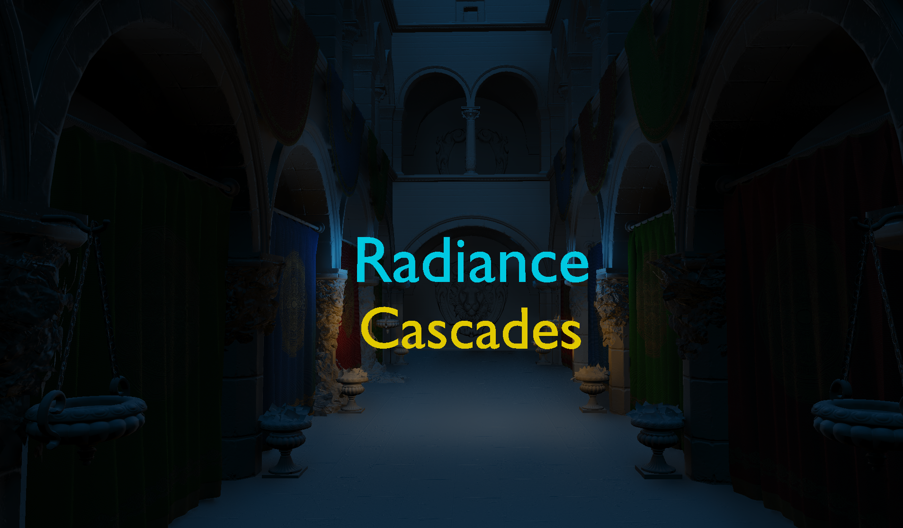
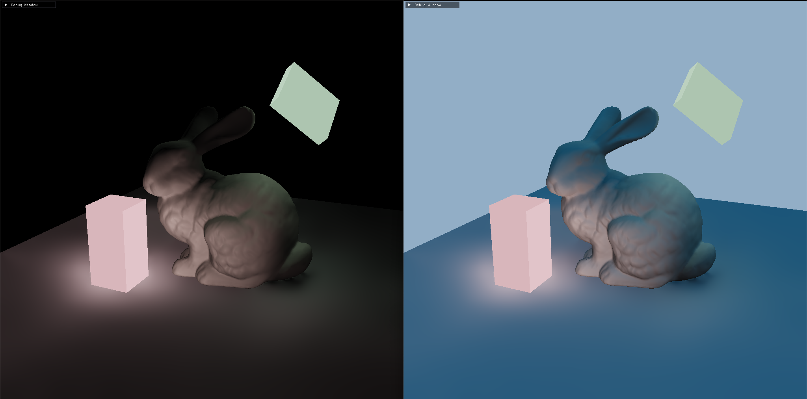
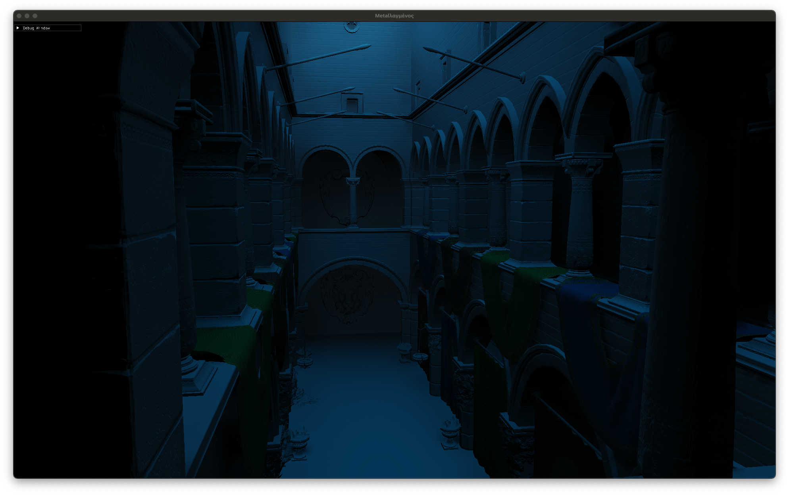
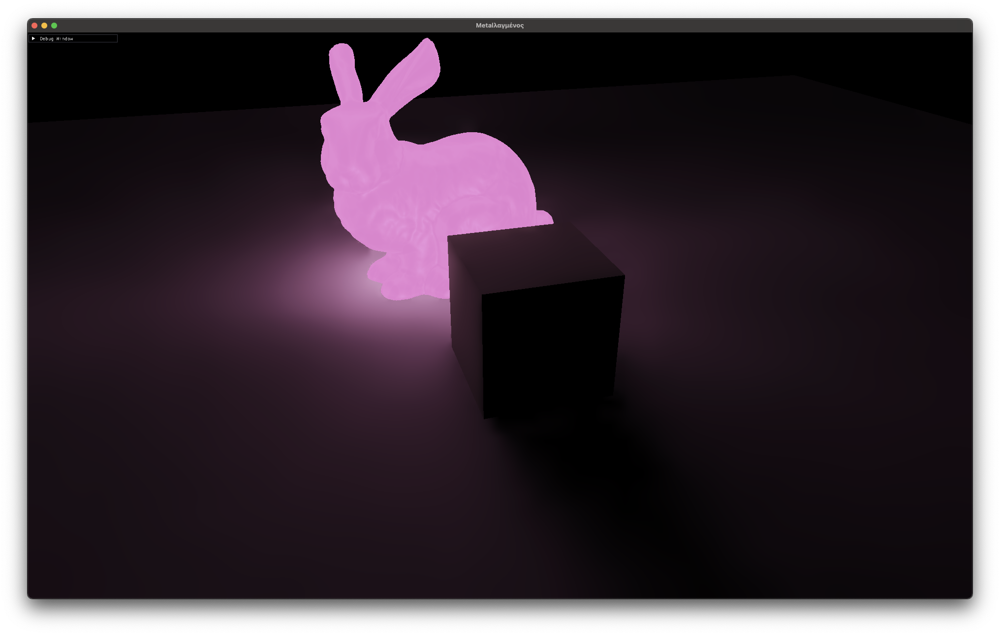
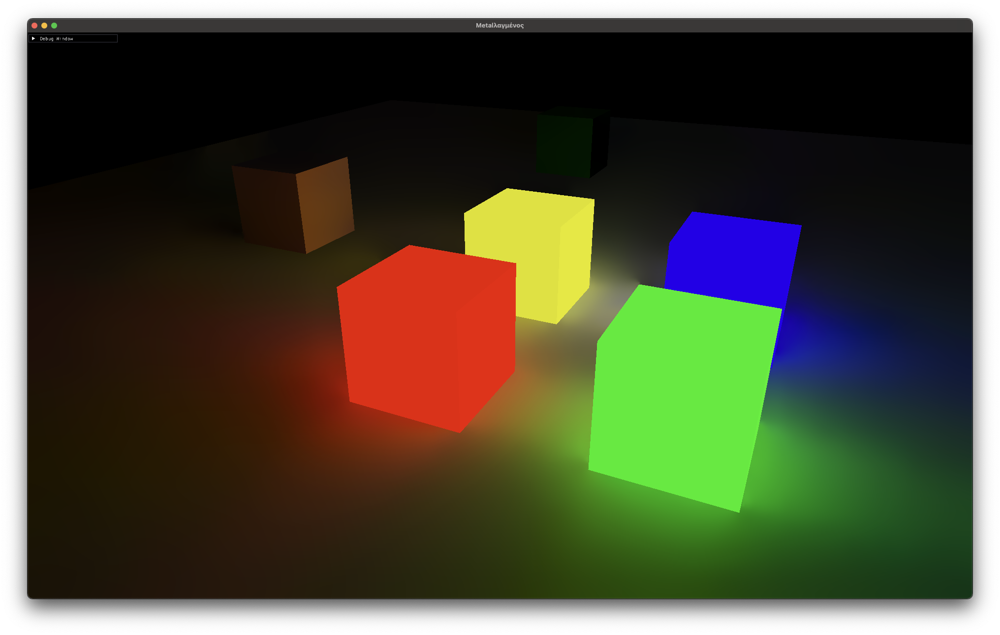
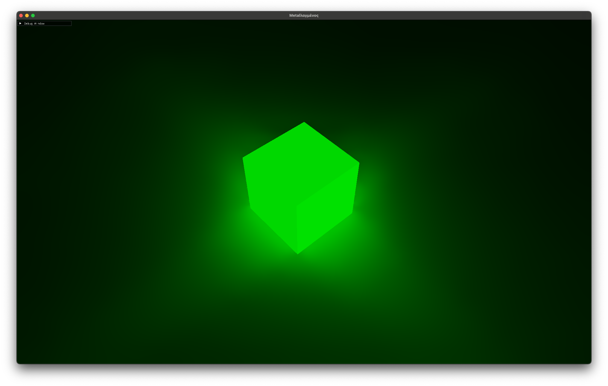
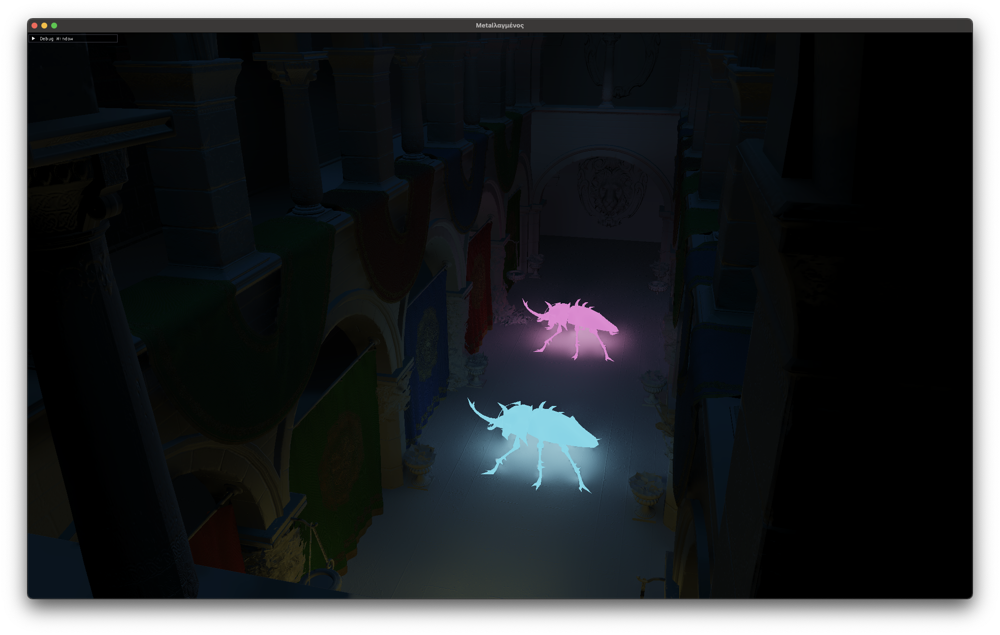

# Radiance Cascade SPWI



A **Diffuse Global Illumination** solution based on Screen-Space Probes with World-Space Intervals. This is an experimental implementation of the technique described in the [Radiance Cascades paper](https://github.com/Raikiri/RadianceCascadesPaper). The project demonstrates the core concepts, it is not ready to be used as a GI solution.

> **Note:** This project is implemented using Apple's Metal API and runs only on Apple silicon.

## Build Instructions
### Prerequisites

Before you start, install **CMake**
### Build 
```bash
git clone https://github.com/Qirias/RC-SPWI
cd RC-SPWI
```
### Xcode
```bash
chmod +x xcode.sh
./xcode.sh
open build_xcode/RC-SPWI.xcodeproj
```

### Standalone
```bash
chmod +x standalone.sh
./standalone.sh
```
## Showcase





